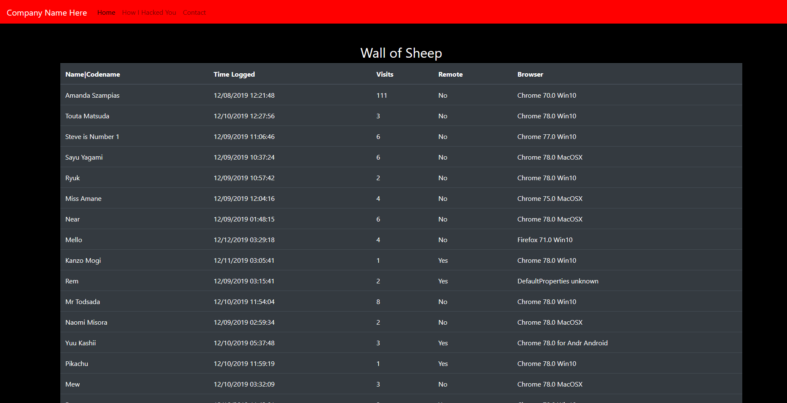
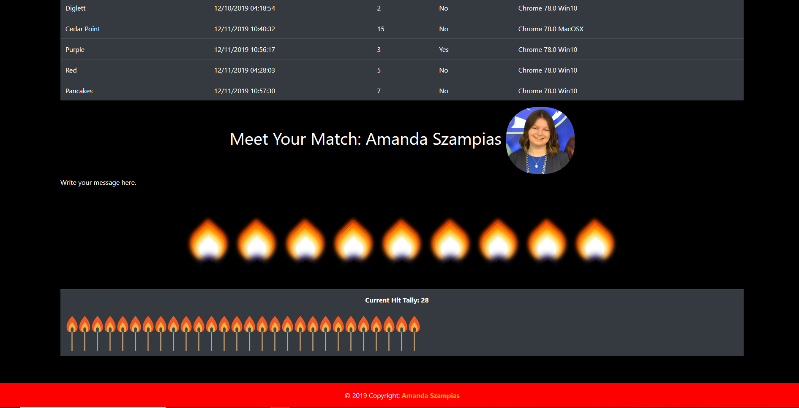

## MatchMaker Phishing Website

1. Install PHP, MySQL, Apache Stack. 
2. Make a configMatch.ini file in /var/config/. Example of file format in notes. 
3. Login to MySQL and copy/paste the notes.sql into the console. This will autocreate the tables. 
4. Start making entries in the Person table. 
5. Your good to go! 

## About
This is a Match-Themed Phishing scoreboard website. If your using this on a company, get permission first!

## Author
Amanda Szampias

## Video and Images

